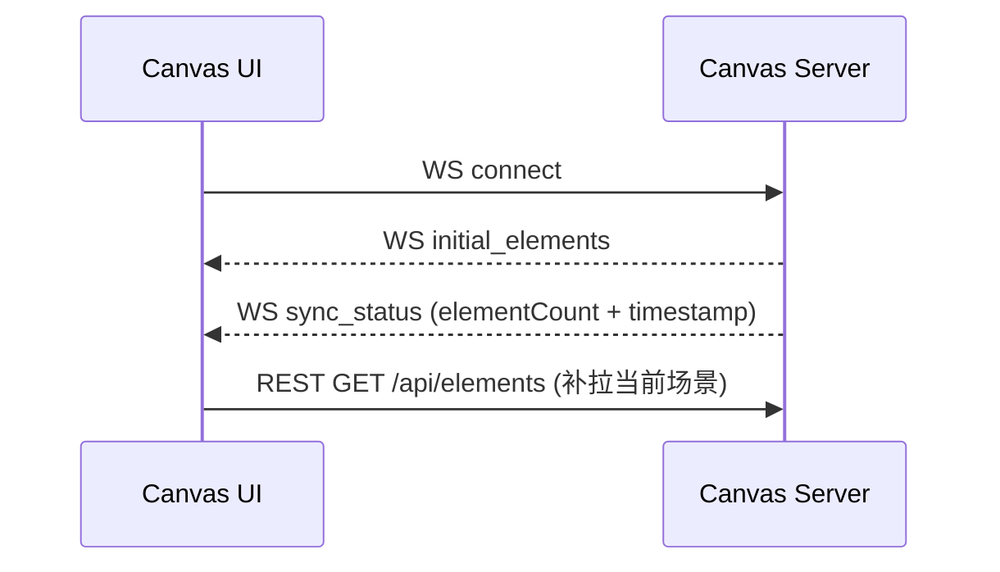
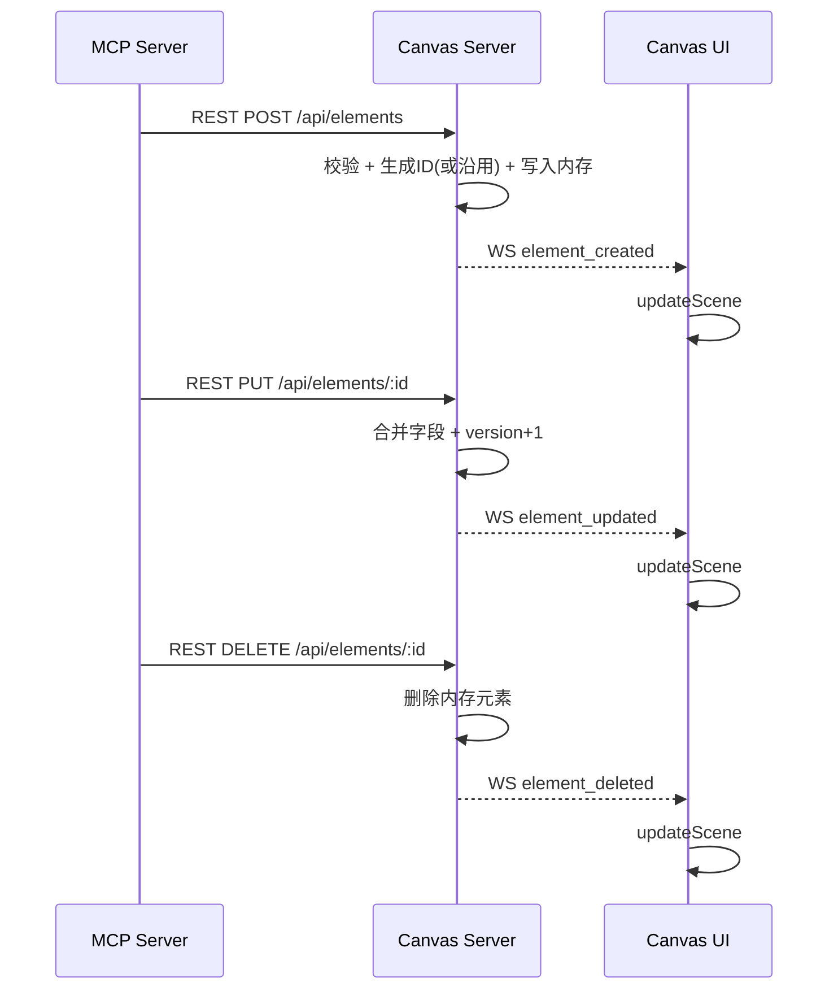
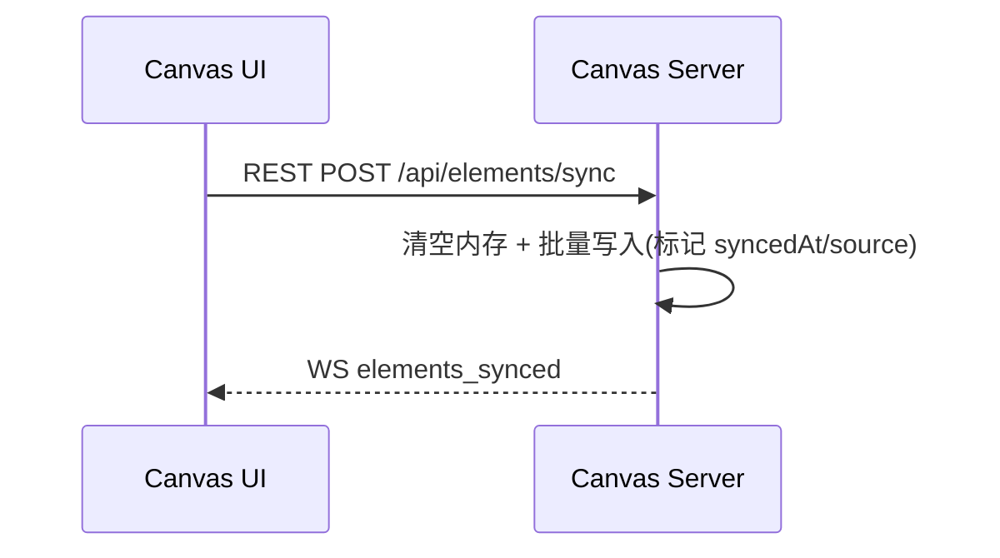
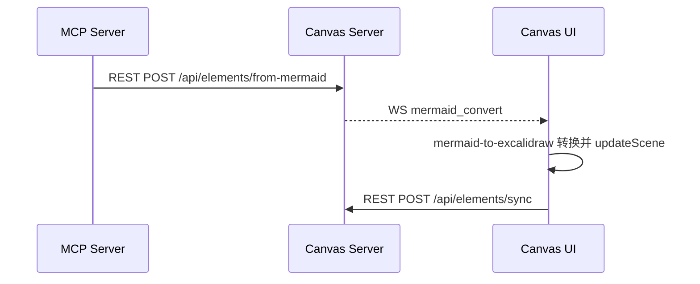
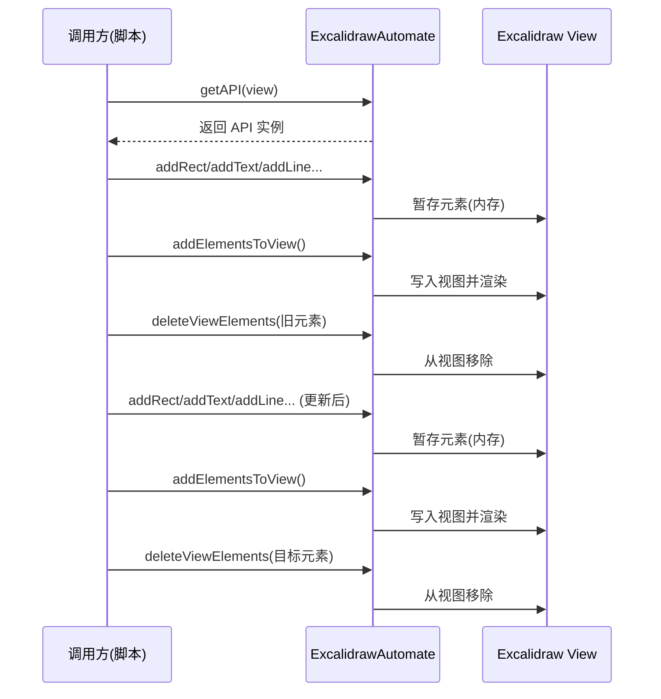
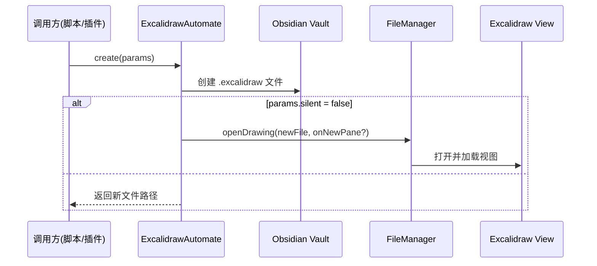
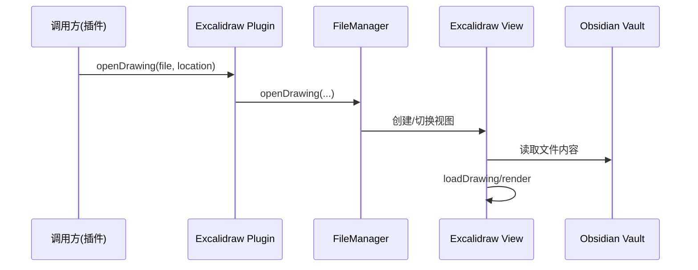
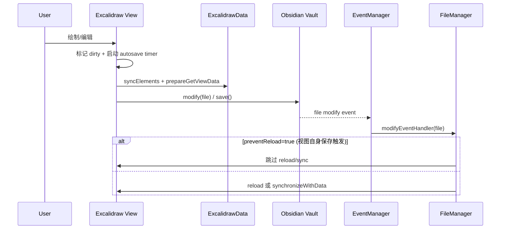
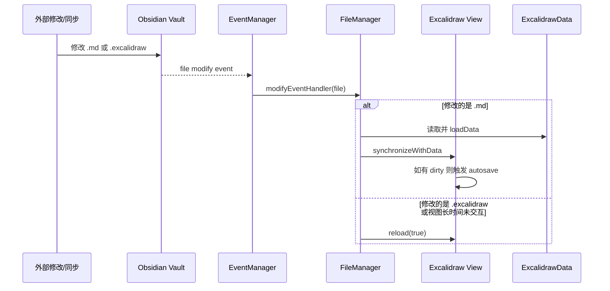
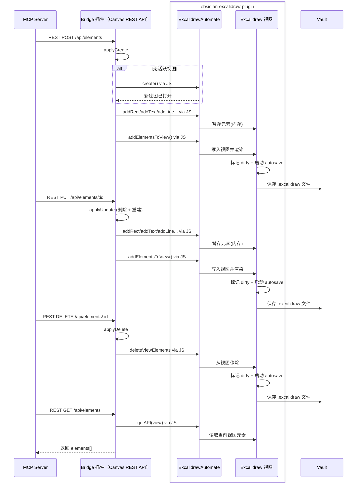

# MCP Excalidraw 桥接 Demo

这是一个最小化的 Obsidian 插件 Demo，用于把 Obsidian Excalidraw 视图与 MCP/Canvas 生态进行桥接。
它作为 Canvas Server 代理，把 MCP 请求直接映射到 Obsidian 视图。


## mcp_excalidraw 实现分析

### 组件与职责

- **Canvas Server（Express + WS）**：内存 Map 维护元素；REST 负责 CRUD/查询/同步；WebSocket 负责广播实时事件。
- **Canvas UI（React + Excalidraw）**：首次通过 REST `/api/elements` 拉取场景，随后依赖 WS 事件增量更新；手动 `Sync to Backend` 走全量 `/api/elements/sync`。
- **MCP Server（stdio transport）**：对外提供 MCP 工具；内部只通过 REST 调用 Canvas Server（`EXPRESS_SERVER_URL`），**不维护本地元素状态**。

### 核心接口与消息

- REST：`/api/elements`、`/api/elements/:id`、`/api/elements/batch`、`/api/elements/search`、`/api/elements/sync`、`/api/elements/from-mermaid`
- WS：`initial_elements`、`sync_status`、`element_created/updated/deleted`、`elements_batch_created`、`elements_synced`、`mermaid_convert`

### 场景一：WS 连接与初始加载



### 场景二：MCP 创建/更新/删除元素（REST + WS）



### 场景三：Canvas UI 全量同步（覆盖式）



### 场景四：Mermaid 转换链路（MCP -> UI）



### 交互逻辑说明

- MCP 的 create/update/delete 只走 REST 调 Canvas Server；MCP 不连接 WebSocket，也不维护本地元素副本。
- Canvas Server 在 REST 内更新内存 Map 后，立即通过 WS 广播 `element_created/updated/deleted` 给所有 UI。
- Canvas UI 收到 WS 事件后本地 `updateScene`，不会再回调 MCP；因此链路为 MCP -> REST -> Canvas Server -> WS -> UI。

### 关键同步逻辑说明

- MCP Server 只负责 REST 调用 Canvas Server；**不会连接 WS，也不保存元素副本**。
- Canvas Server 的元素状态是**内存态**；同步和 CRUD 都以此为准并通过 WS 广播。
- `create_from_mermaid` 不是在服务端转换，而是把 Mermaid 通过 WS 交给前端完成转换并随后全量同步。
- 非 `text` 元素的 `text` 字段会被 MCP Server 转为 Excalidraw `label.text`，以匹配前端渲染格式。


## Obsidian Excalidraw 交互逻辑（源码）

基于 `obsidian-excalidraw-plugin` 源码（`src/view/ExcalidrawView.ts`、`src/core/managers/FileManager.ts`、`src/core/managers/EventManager.ts`）整理如下。

### ExcalidrawAutomate API 交互时序



说明：
- 调用方先通过 `window.ExcalidrawAutomate.getAPI(view)` 获取 API 实例。
- 创建：形状创建方法（如 `addRect`、`addText` 等）会把元素暂存在 EA 的内存上下文中，`addElementsToView()` 才会写入视图并渲染。
- 更新：采用“删除 + 重建”，即先 `deleteViewElements` 再重新 `add* + addElementsToView()`。
- 删除：直接 `deleteViewElements`，视图移除对应元素。

### 创建新绘图与切换视图（API + 时序）

**API 说明**
- **创建新绘图**：`ExcalidrawAutomate.create(params)`  
  - 位置：`obsidian-excalidraw-plugin/src/shared/ExcalidrawAutomate.ts`  
  - 作用：在 Vault 中创建新的 `.excalidraw` 文件，可指定 `filename/foldername/templatePath/onNewPane/silent` 等参数。  
- **切换/打开绘图视图**：`plugin.openDrawing(file, location, active, subpath?, justCreated?)`  
  - 位置：`obsidian-excalidraw-plugin/src/core/main.ts` → `FileManager.openDrawing(...)`  
  - 作用：在当前或新 pane 打开指定绘图文件并加载视图。

**创建新绘图时序**



**切换视图时序**



### 视图保存到文件



说明：
- 用户在视图中编辑后，视图进入 dirty 状态并启动自动保存计时。
- 保存前，视图把场景同步到 ExcalidrawData，并准备写入文件的数据。
- 视图调用 Vault 写回文件（保存或修改）。
- Obsidian 触发文件修改事件，经 EventManager 传给 FileManager。
- 若是视图自身保存触发（preventReload），FileManager 会跳过重载以避免打断编辑。
- 否则按文件类型与状态选择 reload 或 synchronizeWithData 更新视图内容。

### 文件修改触发视图更新



说明：
- 外部修改会触发 Vault 的修改事件，并由 EventManager 交给 FileManager。
- 若修改的是 `.md`（Markdown 模式），FileManager 读取文件并解析成 ExcalidrawData，再同步到视图。
- 同步后若视图仍处于 dirty，会触发一次 autosave 以保持一致。
- 若修改的是 `.excalidraw` 或视图长时间未交互，则直接 reload 视图以加载最新文件内容。


## Bridge Demo 实现

### 组件与职责

- **MCP Server**：通过 REST 调用 Bridge，发起元素创建/更新/删除/查询。
- **Bridge（Canvas REST API）**：对外暴露 `/api/elements` 接口；将请求转换为 ExcalidrawAutomate 调用，直接操作当前活跃的 Excalidraw 视图。
- **obsidian-excalidraw-plugin**：
  - **ExcalidrawAutomate**：提供脚本化 API，执行元素创建/更新/删除。
  - **Excalidraw 视图**：承载绘图结果并负责保存文件。

### 实现原理

- Bridge 作为 **MCP Server 与 Obsidian Excalidraw 的中间人**，对外暴露 REST 接口。
- MCP Server 通过 REST 调用 Bridge 的 `/api/elements` 进行创建/更新/删除/查询。
- Bridge 使用 `window.ExcalidrawAutomate.getAPI(view)` 获取 API，并把元素写入活跃视图。
- 更新逻辑采用“删除 + 重建”（保留 ID，但此 Demo 不保证图层顺序）。
- 查询逻辑直接读取当前活跃 Excalidraw 视图元素并返回。
- 若没有活跃视图且收到创建请求，Bridge 会**自动创建并打开**新绘图，再写入元素。
- 视图写入后由 Obsidian Excalidraw 处理保存（dirty + autosave）。
- Bridge 不做出栈同步，Obsidian 端不会主动推送本地变更到 MCP。
- Bridge 支持 `label.text`，用于非 `text` 元素的标签写入。
- Mermaid 转换链路在该 Bridge Demo 中暂不支持。

### 接口

- `POST /api/elements`
- `PUT /api/elements/:id`
- `DELETE /api/elements/:id`
- `POST /api/elements/batch`
- `POST /api/elements/sync`
- `GET /api/elements`
- `GET /api/elements/:id`
- `GET /api/elements/search`
- `GET /api/sync/status`

说明：`GET /api/elements` 与 `GET /api/elements/:id` 会直接读取当前活跃 Excalidraw 视图中的元素并返回。
说明：`GET /api/elements/search` 支持 `type` 及任意字段的等值过滤（按 query 参数匹配）。
说明：Mermaid 转换链路在该 Bridge Demo 中暂不支持（未实现 `/api/elements/from-mermaid`）。

### 兼容性说明

- Bridge Demo 只支持以下元素类型：`rectangle`、`ellipse`、`diamond`、`text`、`arrow`、`line`。
- `freedraw`、`label` 等类型会被忽略并返回成功，但不会写入视图。

### 时序图



### 构建与安装

1. Install dependencies in this folder:
   - `npm install`
2. Build the plugin:
   - `npm run build`
3. Copy the whole `obsidian-mcp-bridge-demo` folder into your vault:
   - `YourVault/.obsidian/plugins/obsidian-mcp-bridge-demo/`
4. Enable it in Obsidian:
   - Settings → Community plugins → enable.

## 快速使用

1. Ensure `mcp_excalidraw` MCP server is running and `EXPRESS_SERVER_URL` points to the Bridge 代理。
2. Open an Excalidraw file in Obsidian.
3. Create elements from MCP; they should appear in the active Excalidraw view.

MCP server 只需把 `EXPRESS_SERVER_URL` 指向此代理，即可把图元实时写入 Obsidian。

### 设置

编辑插件数据文件以修改代理服务器配置（位于 Obsidian 的 `.obsidian/plugins/obsidian-mcp-bridge-demo/data.json`）：

```
{
  "serverEnabled": true,
  "serverHost": "127.0.0.1",
  "serverPort": 3030
}
```

也可以在 Obsidian 的插件设置界面中直接配置：  
Settings → Community plugins → MCP Excalidraw Bridge Demo。
