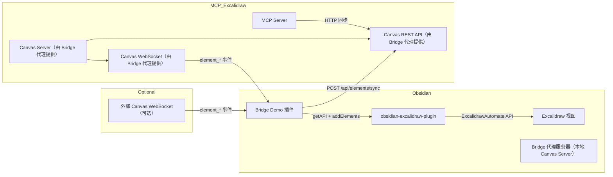
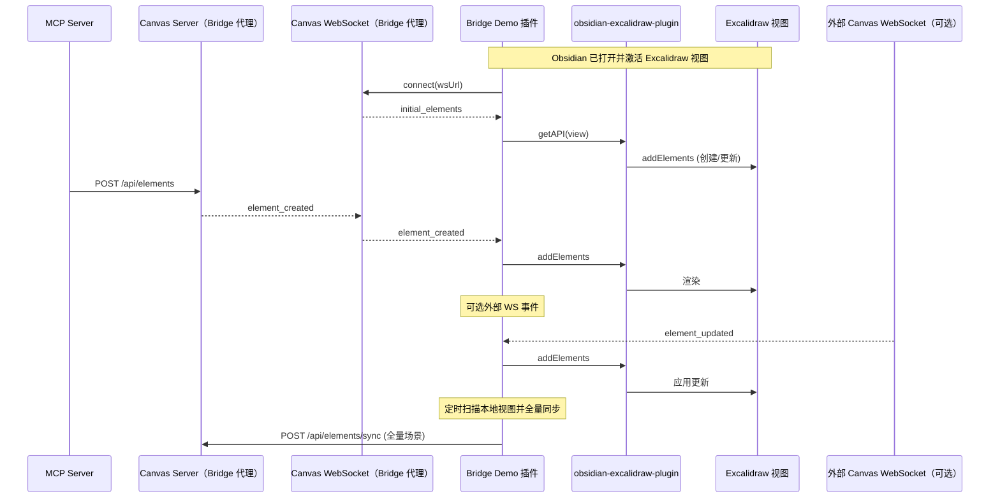
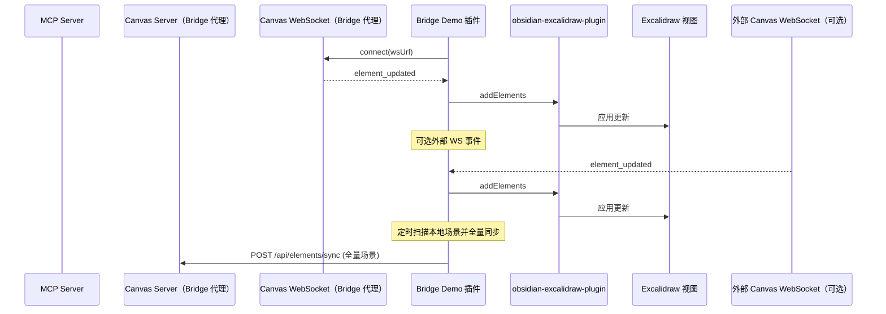
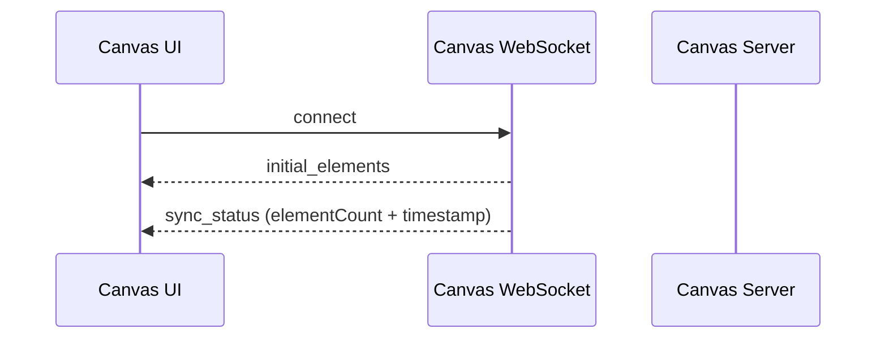
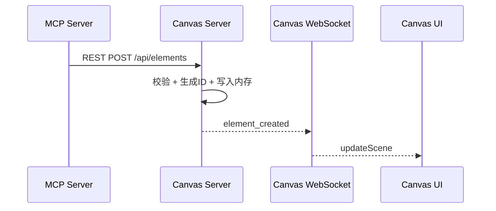
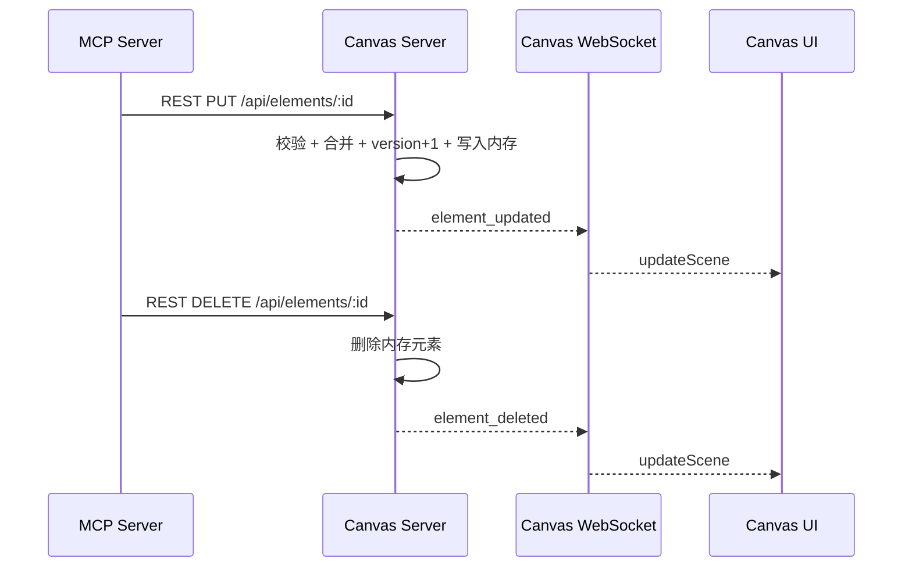
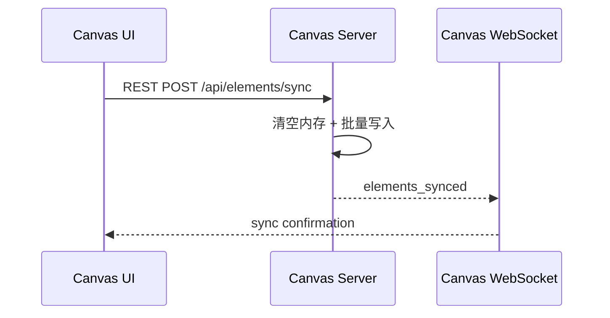
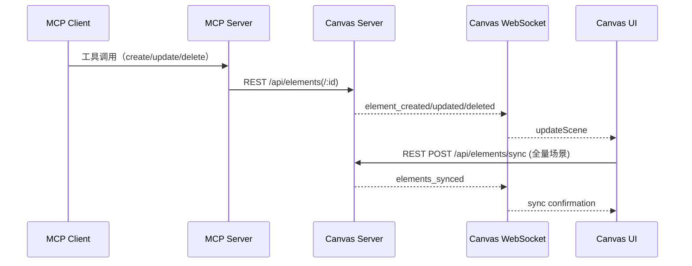

# MCP Excalidraw 桥接 Demo

这是一个最小化的 Obsidian 插件 Demo，用于把 Obsidian Excalidraw 视图与 MCP/Canvas 生态进行桥接。
它既可以作为 Canvas Server 代理，也可以连接外部 Canvas WebSocket 实现实时镜像。

## Bridge Demo（插件实现）

### 实现原理

- 插件可连接外部 Canvas WebSocket，监听 `element_created/updated/deleted` 消息。
- 收到的元素会被转换为最小 Excalidraw 元素，并通过 `window.ExcalidrawAutomate.getAPI(view)` 写入当前 Excalidraw 视图。
- 出站同步可手动触发：命令 `Push active Excalidraw scene to MCP` 会采集当前场景元素并 POST 到 `/api/elements/sync`。
- 更新逻辑采用“删除 + 重建”（保留 ID，但此 Demo 不保证图层顺序）。
- 本 Demo 内置一个最小代理服务器（REST + WS），用于模拟 Canvas Server，把 MCP 请求直接映射到 Obsidian 视图。

### 架构图



### 时序图



### 双向实时（概念说明）

本 Demo 采用**定时全量同步**，不做增量 diff。本地变更会被周期性全量推送到配置的 API 端点；同时可选地接收外部 WS 事件并写入视图。



## mcp_excalidraw 参考说明

### MCP Server, Canvas Server, Canvas UI 交互时序

### 场景一：WS 连接与初始状态同步



### 场景二：MCP 创建元素（REST + WS）



### 场景三：MCP 更新/删除元素（REST + WS）



### 场景四：Canvas UI 全量同步（REST + WS）



### MCP Excalidraw 完整交互时序



### 关键同步逻辑说明

- MCP Server **只通过 REST 写入** Canvas Server，不连接 WebSocket，也不会主动拉取 Canvas Server 数据。
- Canvas Server **只通过 WebSocket 广播**给 UI/客户端，不会向 MCP Server 推送。
- Canvas UI 的“同步”是**全量** `POST /api/elements/sync`，更新的是 Canvas Server 内存状态，并不会直接影响 MCP Server。

### 运行时 Canvas Server 与 MCP 的绘制/导出关系

- MCP Server 不维护独立元素仓库，`create_element`/`batch_create_elements` 直接写入 Canvas Server 的 REST 接口。
- Canvas Server 的元素存储是运行时内存 Map，只要服务在运行，MCP 就能创建/更新图形并立即在 UI 侧通过 WS 反映。
- MCP 的导出（`get_resource: elements` 或 `query_elements`）也是从 Canvas Server 的 `/api/elements` 读取内存数据，所以运行时数据可被直接导出。
- 若 Canvas Server 不运行或不可达，MCP 会返回 “HTTP server unavailable” 的错误，无法绘制或导出。

## 构建与安装

1. Install dependencies in this folder:
   - `npm install`
2. Build the plugin:
   - `npm run build`
3. Copy the whole `obsidian-mcp-bridge-demo` folder into your vault:
   - `YourVault/.obsidian/plugins/obsidian-mcp-bridge-demo/`
4. Enable it in Obsidian:
   - Settings → Community plugins → enable.

## 快速使用

1. Ensure `mcp_excalidraw` canvas server is running.
2. Open an Excalidraw file in Obsidian.
3. Use the command palette:
   - `Push active Excalidraw scene to MCP` for outbound sync.
4. Create elements from MCP; they should appear in the active Excalidraw view.

## 设置

编辑插件数据文件以修改端点（位于 Obsidian 的 `.obsidian/plugins/obsidian-mcp-bridge-demo/data.json`）：

```
{
  "wsUrl": "ws://localhost:3000",
  "apiBaseUrl": "http://localhost:3000",
  "outboundApiBaseUrl": "",
  "serverEnabled": true,
  "serverHost": "127.0.0.1",
  "serverPort": 3030,
  "autoSyncEnabled": true,
  "autoSyncIntervalMs": 1500
}
```

## 代理服务器模式

启用 `serverEnabled: true` 后，插件会在本机启动一个最小代理服务器，暴露以下接口：

- `POST /api/elements`
- `PUT /api/elements/:id`
- `DELETE /api/elements/:id`
- `POST /api/elements/batch`
- `POST /api/elements/sync`
- `GET /api/elements`
- `GET /api/elements/:id`
- `GET /api/sync/status`
- `WS /`（发送 `initial_elements` 与 `element_*` 事件）

MCP server 只需把 `EXPRESS_SERVER_URL` 指向此代理，即可把图元实时写入 Obsidian。

## 本地变更自动推送

开启 `autoSyncEnabled: true` 后，插件会定时扫描当前 Excalidraw 视图，检测到变化后**全量** POST 到 `/api/elements/sync`（目标为 `outboundApiBaseUrl`，为空则使用 `apiBaseUrl`）。

- `autoSyncIntervalMs` 为扫描间隔（毫秒）。
- 插件会对来自 MCP 的远端更新进行短暂抑制，避免回环。 
- 本地变化会通过桥接 WebSocket 广播为 `element_created/updated/deleted`，供连接的客户端实时刷新。
